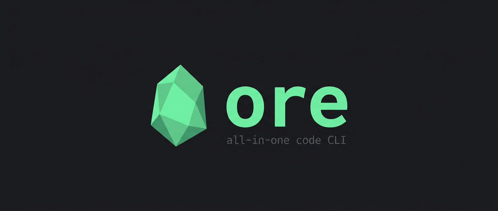
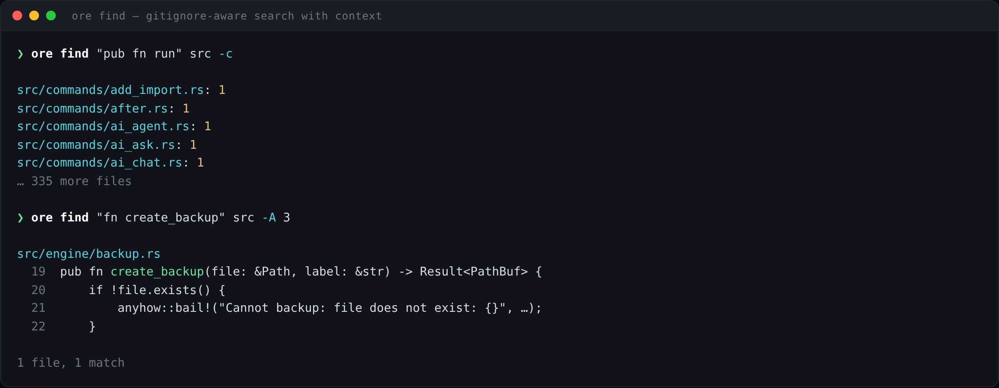
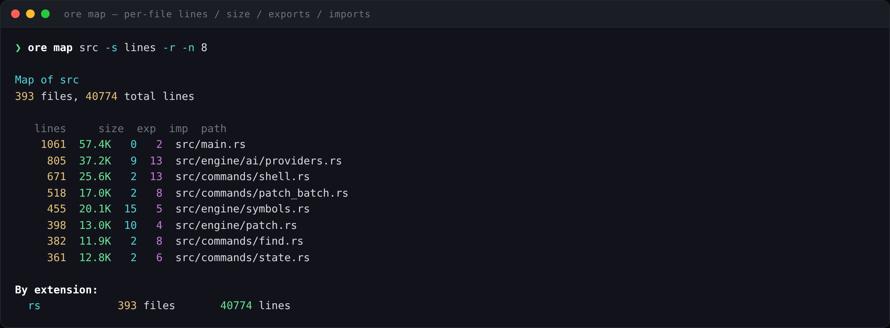
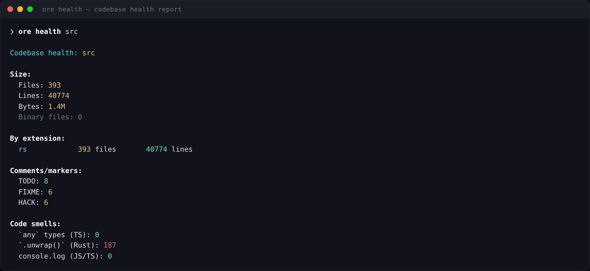
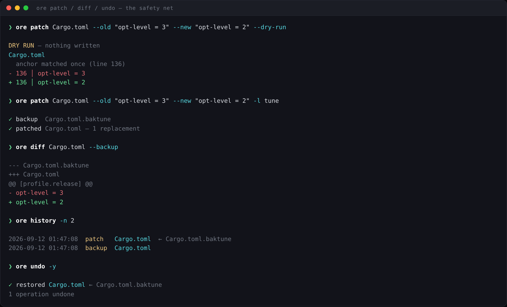
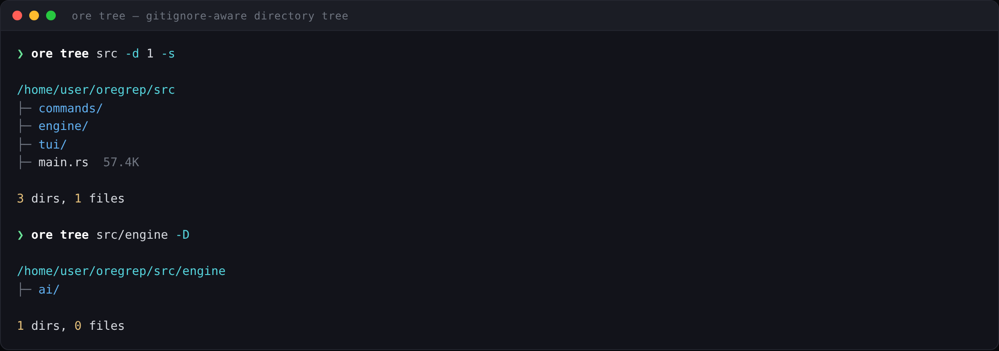
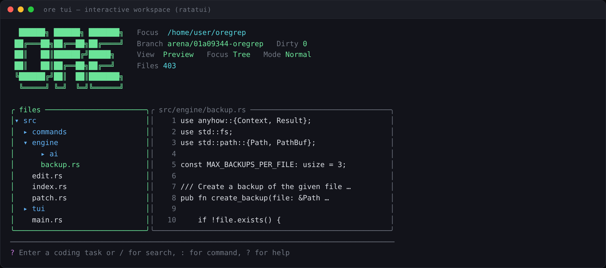

<div align="center">



**A single, offline-first command-line binary that searches, edits, analyses, patches,
verifies and refactors codebases — with an undo safety net on every destructive operation.**

`337 commands` · `~41k lines of Rust` · `one static binary` · `no runtime dependencies`

[What it is](#what-ore-is) ·
[Who it's for](#who-its-for) ·
[Install](#installation) ·
[Usage](#usage) ·
[How it works](#how-it-works) ·
[Command reference](docs/reference.md)

</div>

---

## What `ore` is

**`ore` is a backend / terminal tool. There is no web frontend, no server, and no
network service.** It is a native command-line executable (plus an optional in-terminal
TUI and an optional desktop GUI launcher) that you run against a directory on your own
machine.

The repository is named `oregrep`; the binary it produces is called **`ore`**.

It started as a better `grep` and grew into the layer a developer — or an AI coding
agent — sits on top of when working with a codebase:

| Instead of… | You run |
|---|---|
| `grep -rn` + `find` + `sed` gymnastics | `ore find`, `ore replace-project`, `ore rename-symbol` |
| Hand-editing then praying | `ore patch` (auto-backup) → `ore diff --backup` → `ore undo` |
| `cat`-ing 12 files into an LLM prompt | `ore pack src -e ts --strip-comments -o ctx.md` |
| `curl` + `jq` + `xargs` pipelines | `ore fetch`, `ore json-query`, `ore fetch-many` |
| Reading a repo top-to-bottom | `ore map`, `ore digest`, `ore health`, `ore analyze-coupling` |
| Wiring up Puppeteer for one screenshot | `ore web-screenshot https://… -f` |
| Copy-pasting code into a chat window | `ore ai-ask`, `ore ai-review`, `ore ai-fix` |

The design goal is that **one binary, with no Node/Python/Docker runtime**, can carry an
entire code-manipulation session end to end.

### Why it exists

Most of these jobs already have a tool. The problem is that the tools don't share a
model of the workspace. `ripgrep` doesn't know what `sed` just broke; `curl` doesn't know
about your git branch; your LLM chat doesn't know which files it already read.

`ore` unifies them behind three shared subsystems:

1. **A safety net** — every destructive command backs the file up first, records the
   operation, and can be reverted with `ore undo`.
2. **A workspace index** — an optional SQLite database of files, symbols and imports that
   any command can query instead of rescanning the tree.
3. **A tool surface for AI** — the same commands are exposed to the built-in agents, so an
   LLM edits your code through the *same* backed-up, verifiable path you do.

---

## Who it's for

| Audience | What they get from it |
|---|---|
| **Developers working in large/unfamiliar repos** | `map`, `digest`, `outline`, `refs`, `blast-radius`, `analyze-*` answer "what is this and what breaks if I touch it?" |
| **People doing bulk mechanical edits** | `replace-project`, `rename-symbol`, `move-with-imports`, `patch-batch` — with `undo` when it goes wrong |
| **AI coding agents & the people running them** | `pack`, `pack-lines`, `condense`, `extract`, `verify-anchor`, `patch-preview` are designed to be called by a model; `ai-agent`/`ai-fix` close the loop |
| **Script and CI authors** | Deterministic exit codes, `--json` on most read commands, `verify`, `web-check`, `check-urls` |
| **Anyone tired of tool sprawl** | HTTP client, hex editor, CSV/JSON/YAML/TOML/XML tooling, browser automation and a git porcelain in one binary |

**It is not for you if** you want an IDE, a language server, a build system, or a
package manager — `ore` deliberately isn't any of those (see
[Limitations](#limitations-what-ore-deliberately-does-not-do)).

---

## Screenshots

> Rendered by `docs/screenshots/generate.mjs` (Playwright + Chromium). Every figure in
> these captures — file counts, line counts, sizes, match counts — is computed from this
> repository's own source tree. See [Regenerating the screenshots](#regenerating-the-screenshots).

**Search — gitignore-aware, regex by default, with context**



**`ore map` — per-file lines / size / exports / imports, sortable**



**`ore health` — codebase health report (markers, smells, meta files)**



**The safety net — patch, inspect, undo**



**`ore tree` — gitignore-aware tree with sizes**



**`ore tui` — the interactive workspace (file tree, preview, git, command palette)**



---

## Installation

### Requirements

- **Rust 1.75+** with `cargo` (the only build requirement) — <https://rustup.rs>
- A C toolchain, because `rusqlite` builds a bundled SQLite
- Optional at *runtime*: a Chrome/Chromium install for the `web-*` browser commands,
  and `git` on `PATH` for the `git-*` commands

### Build from source

```bash
git clone https://github.com/im-oree/oregrep
cd oregrep

cargo build --release          # → target/release/ore
```

Then put it on your `PATH`:

```bash
# Linux / macOS
sudo install -m755 target/release/ore /usr/local/bin/ore

# Windows (PowerShell) — copy target\release\ore.exe somewhere on %PATH%
Copy-Item target\release\ore.exe "$env:USERPROFILE\bin\ore.exe"
```

Verify:

```bash
ore --version
ore --help              # lists all 337 subcommands
ore find --help         # per-command flags (always authoritative)
```

### Optional feature: OS keyring for API keys

By default AI keys are stored in a file in the state directory. To use the OS keyring
instead:

```bash
cargo build --release --features keyring-backend
```

### Build profile

`[profile.release]` uses `opt-level = 3`, fat LTO, `codegen-units = 1` and `strip = true`.
The result is a slow build and a small, fast, self-contained binary — a full release build
takes several minutes and compiles ~300 crates.

---

## Usage

### The shape of every command

```
ore <command> [options] [arguments]
```

`ore <command> --help` is always the authoritative flag list. `docs/reference.md` is the
prose reference: what each command is *for*, its use cases, and — explicitly — what it
**cannot** do.

### Five minutes with `ore`

```bash
# 1 — orient yourself in an unfamiliar repo
ore tree src -d 2                       # structure
ore map src -s lines -r -n 15           # biggest files, most exports
ore health .                            # TODOs, smells, missing meta files
ore digest .                            # structural summary, LLM-sized

# 2 — find things
ore find "TODO|FIXME" src -i -c         # counts per file
ore find "createUser" src -e ts -A 3    # regex + 3 lines of trailing context
ore search-fuzzy "usrService"           # typo-tolerant
ore refs createUser src                 # every reference to a symbol
ore used-by src/db.ts                   # who imports this file

# 3 — edit safely (auto-backup unless you pass --no-backup)
ore patch src/app.ts --old "const x = 1" --new "const x = 2" --dry-run
ore patch src/app.ts --old "const x = 1" --new "const x = 2"
ore diff src/app.ts --backup            # what did I just change?
ore undo -y                             # take it back

# 4 — bulk edits across the project
ore replace-project "oldApi" "newApi" -e ts,tsx --dry-run
ore rename-symbol getUser fetchUser src
ore move-with-imports src/a.ts src/lib/a.ts   # updates every importer

# 5 — verify
ore verify-compile                      # autodetects ts / rust / node
ore verify                              # typecheck + lint + tests
ore errors-last                         # replay the last cached compile errors
```

### Building context for an LLM

This is the workflow `ore` is unusually good at:

```bash
ore pack src/auth -e ts --strip-comments --include-tree -o ctx.md
ore pack-lines src/a.ts:80-120 src/b.ts:1-50 --format md
ore pack-changed HEAD --format md            # everything you changed
ore neighbors src/db.ts --pack               # the dependency neighbourhood
ore condense src/huge.ts                     # comment-stripped, token-cheap
```

### HTTP, data and binaries

```bash
ore fetch https://api.example.com/users -H "Authorization: Bearer $T" --pretty
ore post https://api.example.com/users --json '{"name":"ada"}'
ore json-query package.json '$.dependencies'
ore csv-stats data.csv
ore hex-view firmware.bin -o 0x100 -l 256
ore strings app.exe -n 8
```

### Browser automation

```bash
ore web-screenshot https://example.com -f -o shot.png
ore web-screenshot-set https://example.com -s 375,768,1440   # responsive audit
ore web-scrape https://example.com/items -r ".item" -f "name=h2" -f "price=.price" -F csv
ore web-check -f routes.txt -F                               # post-deploy smoke sweep
```

Each `web-*` command launches a **fresh, stateless** headless browser. Nothing persists
between invocations — no cookies, no login sessions, no typed values.

### AI commands

AI is **opt-in and bring-your-own-key**. Nothing is sent anywhere until you register a
provider or point `ore` at a local model server.

```bash
ore ai-keys register groq gsk-…      # or env: GROQ_API_KEY, OPENAI_API_KEY, …
ore ai-keys test groq
ore ai-providers                     # what's usable right now
ore ai-config set default_provider groq

ore ai-ask "how does the undo system work?"   # read-only tools by default
ore ai-review src/db.ts
ore ai-fix src/main.ts -i "unused variable warnings" --auto
ore ai-usage -d 7                    # tokens + cost, per workspace
```

Supported backends: `openai`, `anthropic`, `groq`, `openrouter`, `google`, `mistral`,
`deepseek`, plus local `ollama` and `lmstudio` (which need no key, just a running server).

### The interactive modes

```bash
ore tui         # full-screen workspace: tree, preview, search, git, hex, health
ore shell       # a REPL with tab-completion over all 337 commands
```

TUI keys: `j`/`k` move · `Enter` open · `Tab` switch pane · `/` search · `:` run any
`ore` command · `g` git · `x` hex · `H` health · `?` help · `q` quit.

### Desktop GUI launcher (Windows-oriented, optional)

`ore-runner.pyw` is a small Tkinter GUI: paste a block of `ore` commands on the left,
press **Run**, watch the output on the right. It shells out to `ore.exe` with an argument
array (no shell interpretation, no encoding corruption) and skips markdown/prose lines, so
you can paste a whole recipe out of a chat log and run it.

```bash
python ore-runner.pyw      # needs Python 3 with tkinter; finds ore on PATH
```

---

## How it works

### Architecture

```
src/
├── main.rs              1061 lines — clap CLI: 337 subcommands → commands::<mod>::run()
├── commands/            347 files  — one module per command, each with an Args struct
├── engine/              the shared subsystems every command builds on
│   ├── backup.rs        create/list/restore backups (max 3 per file, oldest evicted)
│   ├── history.rs       operation log; the source of truth for undo/redo
│   ├── patch.rs         anchor matching (exact, regex, fuzzy) + safe rewrite
│   ├── edit.rs          line/range editing primitives
│   ├── walker.rs        gitignore-aware traversal, extension/exclude filters
│   ├── encoding.rs      charset detection + smart decode, binary sniffing
│   ├── symbols.rs       regex symbol extraction (TS/JS/Rust/Python)
│   ├── analysis.rs      coupling, complexity, duplication, dead exports
│   ├── index.rs         SQLite index (files, symbols, imports)
│   ├── git.rs, proc.rs, http.rs, web.rs, hex.rs, formats.rs, images.rs, …
│   └── ai/              providers, router, tools, sessions, usage, budgets, prompts
└── tui/                 ratatui app: app.rs (state), ui.rs (render), events.rs (keys)
```

Adding a command means adding `src/commands/<name>.rs` with a
`#[derive(Args)] pub struct XArgs` and `pub fn run(args: XArgs) -> Result<()>`, then one
enum variant and one match arm in `main.rs`.

### The safety net

Every editing command (`patch`, `replace`, `insert`, `delete-lines`, `mv`, `cp`, `rm`,
`encoding`, `rename-bulk`, and friends) does this unless you pass `--no-backup`:

```
read → backup → write → record the operation in the history log
```

- Backups are **siblings** of the file: `app.ts.bak20260912-014708`, or `app.ts.bakLABEL`
  with `-l LABEL`. **Only the 3 most recent backups per file are kept** — the oldest is
  deleted automatically.
- `ore history` lists every recorded operation, newest first.
- `ore undo [N]` restores from those backups. `ore restore <file>` does it manually.
- `ore diff <file> --backup` shows what changed since the backup.
- **`ore redo` does not replay a change.** It only clears the "undone" mark so `undo`
  won't re-apply it. This surprises people; it is by design.

`ai-fix` and `ai-refactor` are built on exactly this loop: back up → patch → verify →
restore on failure.

### The index

`ore index-build` creates a SQLite database at `<workspace-root>/.ore-index/index.db`
holding files, symbols and imports. `index-update` refreshes only what changed;
`index-search` answers symbol queries without touching the filesystem; `index-gc` removes
orphans and vacuums.

The index is **opt-in** — `--from-index` is off by default, and every command works
without it, just slower. `ore` adds `.ore-index/` to your `.gitignore` automatically.

### State locations

| What | Where |
|---|---|
| Global config, aliases, focus, sessions | Windows `%APPDATA%\ore\` · Unix `~/.config/ore/` |
| AI config / keys | `ai.toml` and `secrets.toml` in that same state directory |
| Index DB + AI usage, history, sessions | `<workspace>/.ore-index/index.db` |
| Backups | Next to the file being edited (`<name>.bak…`) |

Because the AI tables live in the *workspace* index, `ai-usage`, `ai-history`,
`ai-session` and `ai-recall` are **per-project** by design — `cd` elsewhere and you see
that project's history.

### Exit codes

| Code | Meaning |
|---|---|
| `0` | Success |
| `1` | Command failed — validation, network, HTTP error, budget exceeded. Some commands use this as a *signal*: `web-ws-status` exits 1 when a page isn't ready, `patch-preview` exits 1 when the anchor isn't found, `verify-anchor` likewise |
| `2` | Usage error (bad flags/arguments), emitted by clap |

That makes the check-style commands directly chainable:

```bash
ore verify-anchor src/app.ts "const config" && ore patch src/app.ts --old … --new …
```

### Output conventions

- Colour by default; a broken-pipe hook means `ore find … | head` exits cleanly instead
  of panicking.
- `-j` / `--json` for machine-readable output on most read commands.
- AI commands can emit a structured event stream on stderr with `--events-json`
  (one JSON object per line) for GUIs and tooling.

---

## Command families

All 337 commands, grouped. Full prose for each — including per-command limitations —
is in **[`docs/reference.md`](docs/reference.md)**; a generated flag dump is in
[`docs/COMMAND_REFERENCE.md`](docs/COMMAND_REFERENCE.md).

| Family | Commands (selection) |
|---|---|
| **Files & I/O** | `find` `find-multi` `cat` `cat-around` `line` `tree` `head` `tail` `count` `stats` `wc` `mv` `cp` `rm` `touch` `mkdir` `mkfile` `checksum` `find-dupes` `extract` `slice` `map` `show` `copy` `to-temp` `open-file` |
| **Editing & safety** | `patch` `patch-lines` `patch-insert` `patch-regex` `patch-fuzzy` `patch-batch` `patch-preview` `replace` `insert` `delete-lines` `replace-range` `before` `after` `surround` `rename-bulk` `backup` `restore` `purge-backups` |
| **Diffs & merges** | `diff` `diff-backup` `diff-word` `diff-semantic` `diff-ignore` `diff-dirs` `diff-summary` `merge3` `apply-patch` `revert-patch` |
| **Search** | `search-and` `search-or` `search-negative` `search-multiline` `search-fuzzy` `search-changed` `search-history` `search-diff` |
| **Git** | `git-status` `git-changed` `git-diff` `git-log` `git-blame` `git-who` `git-stage` `git-commit` `git-amend` `git-fixup` `git-changelog` `git-release-notes` `git-cleanup-branches` `compare-branches` |
| **Process automation** | `run` `wait` `retry` `parallel` `sequence` `watch` `watch-multi` `on-error` `on-success` `monitor` `notify` `schedule` `timer` `benchmark` `ps` |
| **HTTP & network** | `fetch` `post` `download` `headers` `status` `ping` `dns` `api-test` `upload` `fetch-many` `download-many` `check-urls` `resume-download` `bench-url` `ws` `crawl` |
| **Binary & hex** | `hex-view` `hex-find` `hex-replace` `hex-patch` `hex-diff` `hex-insert` `hex-delete` `strings` `magic` `bin-stats` `xxd` `bin-slice` `bin-cat` `base64-encode` `base64-decode` |
| **Structured data** | `json-get/set/merge/fmt/query/keys` `yaml-*` `toml-*` `csv-query/filter/select/stats/to-json` `env-get/set/diff` `xml-get/fmt/to-json` |
| **Code intelligence** | `symbols` `outline` `snippet` `pluck` `refs` `who-calls` `used-by` `imports-of` `neighbors` `explain-symbol` `trace` `flow` `blast-radius` `impact` `related` `route` |
| **Structural refactors** | `add-import` `remove-import` `split-file` `merge-files` `extract-fn` `move-with-imports` `hub` `flatten-hub` `rename-symbol` `rename-safe` `organize` `consolidate` `trim-dead` |
| **Analysis** | `analyze-imports/exports/coupling/churn/hotspot/complexity/dead-exports/circular/type-coverage/duplication` `hot-files` `stale-files` `since` |
| **Reports** | `report-health` `report-todos` `report-imports` `report-api` `report-contributors` `report-coverage` `report-changes` `report-errors` `workspace-report` `health` `digest` |
| **Compile & verify** | `compile-ts` `compile-rust` `compile-node` `errors-last` `verify` `verify-compile` `verify-anchor` `verify-and-apply` `verify-json` `verify-syntax` `verify-encoding` `verify-imports` `re-anchor` |
| **Scaffolding** | `scaffold` `scaffold-add/component/hook/store/context/api/test` `setup` `template` `snip` `macro` `check-deps` `install-if-missing` |
| **Workspace** | `session` `session-export` `focus` `notes` `bookmark` `tag` `lock` `unlock` `locks` `config` `alias` `state` `tui` `shell` |
| **Index & history** | `index-build` `index-update` `index-status` `index-search` `index-gc` `index-clear` `index-locate` `history` `undo` `redo` |
| **Browser** | `web-open` `web-screenshot` `web-screenshot-many` `web-screenshot-set` `web-pdf` `web-text` `web-html` `web-title` `web-links` `web-click` `web-type` `web-eval` `web-wait` `web-scrape` `web-cookies` `web-check` `web-ws-status` |
| **Web search & AI** | `web-search` `web-search-config` `web-fetch-clean` `ai-keys` `ai-config` `ai-models` `ai-providers` `ai-ask` `ai-chat` `ai-agent` `ai-explain` `ai-review` `ai-fix` `ai-refactor` `ai-commit-message` `ai-session` `ai-history` `ai-recall` `ai-usage` `ai-budget` `ai-prompts` |

---

## Limitations (what `ore` deliberately does *not* do)

Being honest about this is more useful than a feature list:

- **It is not an IDE and has no editor.** `ore tui` browses, previews and launches
  commands; it does not let you type into a file. Editing happens through commands, and
  safety comes from backups and `undo`.
- **It is not a language server.** Symbol extraction, imports and refactors are
  **regex-based** heuristics over TS/JS/Rust/Python. They are fast and work on broken
  code, but they do not understand types, macros or dynamic imports. Always review a
  `rename-symbol` diff.
- **`redo` does not replay changes** — it only clears the undone mark.
- **Only 3 backups are kept per file.** A fourth edit evicts the oldest. `ore` is not a
  version-control system; git still is.
- **Browser automation is stateless per command.** No cookie/session persistence between
  `web-*` invocations, by design.
- **AI needs a backend.** No key and no local server means AI commands fail with a clear
  error. Free tiers rate-limit (HTTP 429) and cap payloads (413); `ore` retries with
  backoff but cannot remove those limits.
- **Some commands are Windows-flavoured.** `schedule` wraps Windows Task Scheduler,
  `show` defaults to notepad, and `ore-runner.pyw` looks for `ore.exe`.
- **No image/SVG conversion commands.** The `convert-*` family was scaffolded but never
  shipped, despite the image crates in `Cargo.toml`.
- **Not a package manager.** `install-if-missing` can invoke winget/choco/npm/cargo/scoop
  for *tools*, but `ore` does not manage your project's dependencies.

---

## Development

```bash
cargo build                 # debug build → target/debug/ore
cargo build --release       # optimized, LTO, stripped
cargo check                 # fast type check while iterating
cargo clippy                # lints
```

`ore` can develop itself:

```bash
ore compile-rust            # cargo check, errors parsed + cached
ore errors-last -g          # replay them, grouped
ore verify                  # typecheck + lint + tests
ore health .                # what state is this repo in?
```

### Regenerating the screenshots

The README figures are generated, not hand-captured, so they can be refreshed whenever
output formats change.

```bash
npm install playwright            # or: npm i -D playwright
npx playwright install chromium   # once; skip if you set CHROME_PATH

node docs/screenshots/generate.mjs
```

- `docs/screenshots/shots.mjs` holds the transcripts and a tiny colour markup
  (`{c:cyan}`, `{g:green}`, `{y:yellow}`, `{m:magenta}`, `{d:dim}`, `{B:bold}`) that
  mirrors `src/tui/theme.rs` and the `colored` crate defaults.
- `docs/screenshots/generate.mjs` paints them into an HTML terminal and captures each one
  with Chromium at 2× device scale.
- To use an existing browser instead of Playwright's download:
  `CHROME_PATH=/path/to/chromium node docs/screenshots/generate.mjs`.

### Repository layout

```
Cargo.toml            crate manifest, ~40 dependencies, release profile
src/                  the CLI (see Architecture above)
docs/reference.md     complete prose reference — use cases + limitations per command
docs/COMMAND_REFERENCE.md   generated flag dump
docs/assets/          logo
docs/screenshots/     README figures + the Playwright generator
ore-runner.pyw        optional Tkinter GUI launcher
list-files.ps1        Windows helper: dump a filtered file inventory
```

---

## Licence

No licence file is currently present in this repository. Until one is added, all rights
are reserved by the author and the code is not licensed for redistribution.
